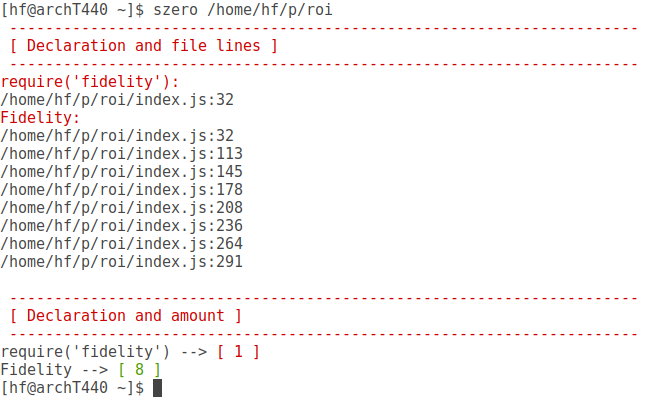

# szero

|                 | Project Info  |
| --------------- | ------------- |
| License:        | MIT |
| Build:          | make |
| Documentation:  | N/A |
| Issue tracker:  | https://github.com/panther-js/szero/issues |
| Engines:        | Node.js 4.x, 5.x, 6.x |

## Installation

    npm install szero -g

## Usage

    $ szero /path_to/myproject

